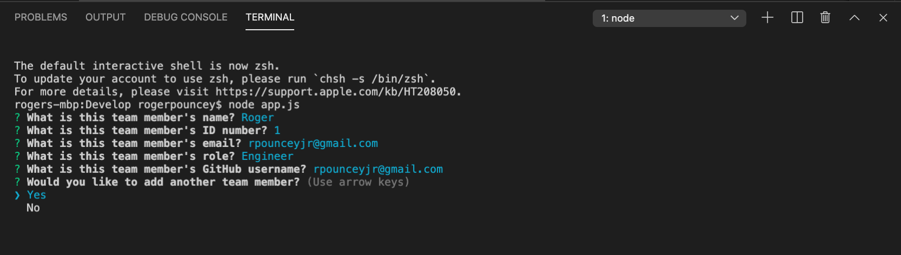
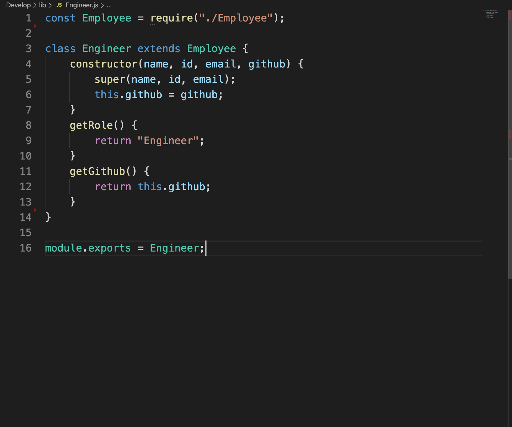
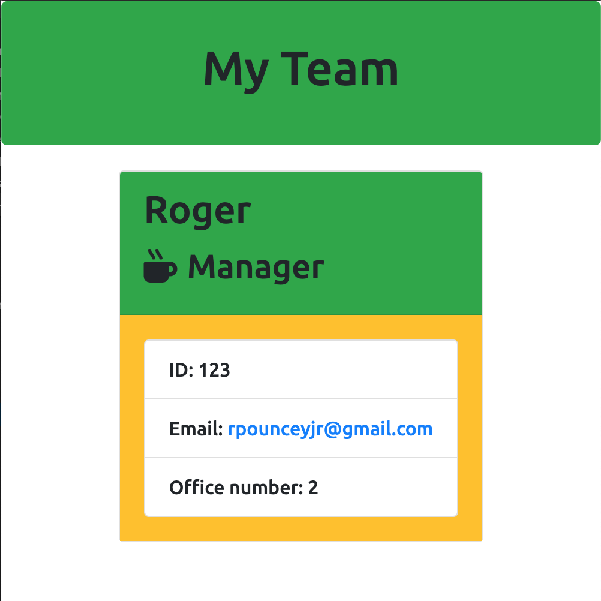

# Template Engine - Employee Summary

### **by Roger Pouncey** 

A command line program that uses ES6 classes to create an HTML page for a work team based on input received from inquirer.

Email: rpounceyjr@gmail.com

## **Table of Contents** 

#### i. [Installation](#installation)

#### ii. [Usage](#usage)

#### iii. [Contributing](#contributing)

#### iv. [Tests](#tests)

#### v. [Questions](#questions)

## **Installation** 
 
                $ npm i

## **Usage** 

This command line app can be used as a template to create a well-formatted HTML page for your team.  Through a variety of inquirer questions, users are able to answer questions about their team members. In addition to inquiring about the team member's name, ID, and email,  each of the 3 different types of Employee - Manager, Engineer, and Intern- are asked role-specific questions.  

After all questions have been answered for a team member the information from the inquirer response is passed to one of the three Employee classes as arguments for a constructor.  Once the new Employee object has been created, the object is pushed to an array containing the team's Employee objects and the user is given the option to create another employee object.  

When the user finishes inputting employees, the data from the team array is rendered as html and written to a team template using fs.writeFile.  Each team member's role-specific information is displayed on a neatly formatted card in the rendered HTML file.
## **Contributing** 

This project was created by Roger Pouncey.  Improvements can be made to the app by making a pull request on GitHub.

## **Tests** 

Tests for each of the class modules were performed with Jest.

## **Questions** 

Questions about this app can be addressed to Roger Pouncey, either through GitHub or via the above email address.